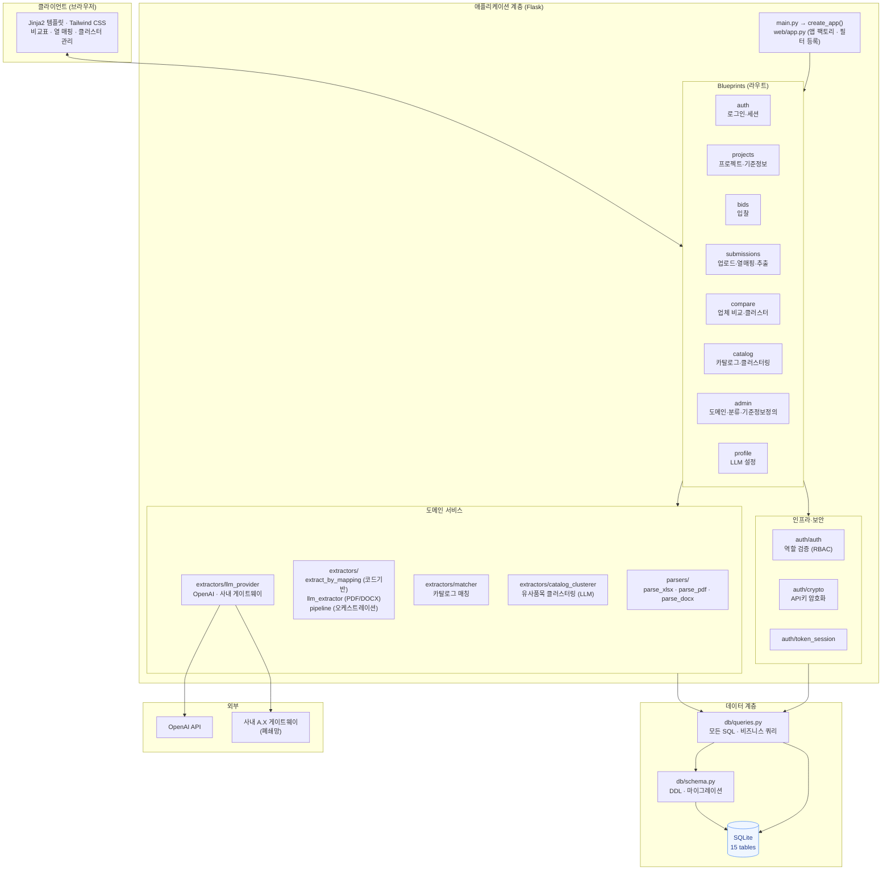
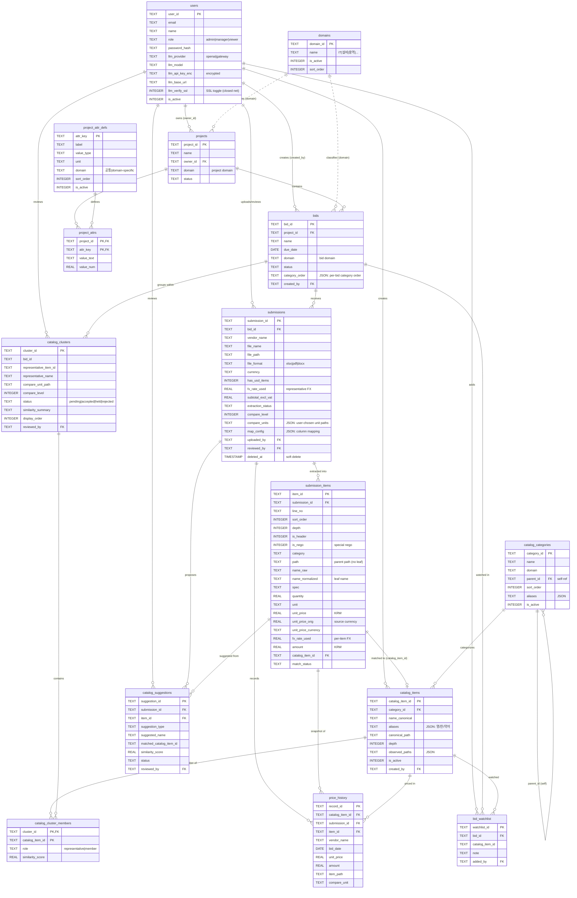

# QDBT 시스템 구조 및 데이터 모델

**조달 견적 비교 도구 (Quote Comparison / Bid Tool)** — Flask · Python · SQLite
전 도메인(IT · 설비 · 용역 등) 입찰 견적서를 업로드·추출·정규화하여 업체별로 원화 기준 비교하는 시스템.

---

## 1. 시스템 아키텍처

계층형 구조로, 라우트(Blueprint) → 도메인 서비스 → 데이터 계층으로 의존성이 단방향으로 흐른다.
모든 SQL은 `db/queries.py`에 집중되어 데이터 접근이 단일 지점으로 통제된다.

### 계층 설명

- **애플리케이션 진입점**: `main.py`가 `create_app()`(앱 팩토리)을 호출해 Flask 앱을 구성하고, Jinja 필터(`treepath_above`·`cursym`·`leaf` 등)와 8개 Blueprint를 등록한다.
- **Blueprints (라우트 계층)**: 기능 도메인별로 분리 — 인증(auth), 프로젝트·기준정보(projects), 입찰(bids), 업로드·열매핑·추출(submissions), 업체 비교·클러스터(compare), 카탈로그·클러스터링(catalog), 관리(admin), LLM 설정(profile).
- **도메인 서비스**: 파서(`parsers/`)가 원본 파일을 텍스트/그리드로 변환하고, 추출기(`extractors/`)가 구조화한다. 코드 기반 결정론적 추출(`extract_by_mapping`)과 LLM 추출(`llm_extractor`)이 병존하며, `pipeline`이 오케스트레이션한다. 매칭(`matcher`)·클러스터링(`catalog_clusterer`)이 카탈로그와 정합하고, `llm_provider`가 OpenAI 및 사내 게이트웨이 호출을 추상화한다.
- **인프라·보안**: 역할 기반 접근제어(RBAC, `auth/auth`), API 키 암호화(`crypto`), 토큰 세션(`token_session`).
- **데이터 계층**: `queries.py`(모든 SQL)와 `schema.py`(DDL·마이그레이션)가 SQLite(15 테이블)를 관장한다.

---

## 2. 핵심 데이터 흐름

견적서 업로드부터 비교표 생성까지의 파이프라인. 각 단계가 어떤 함수·테이블과 연결되는지 표시한다.

```mermaid
flowchart LR
    upload["1. 견적서 업로드<br/>(xlsx/pdf/docx)"]
    --> route{"파일 형식"}

    route -->|xlsx| colmap["2a. 열 매핑 화면<br/>suggest_column_mapping<br/>역할 지정 + 비교단위 선택"]
    route -->|pdf/docx| llmx["2b. LLM 추출<br/>llm_extractor"]

    colmap --> extract["3. 결정론적 추출<br/>extract_by_mapping<br/>· 통화 정규화<br/>· 환율 역산 (원화÷통화)<br/>· 원화 확정"]
    llmx --> extract

    extract --> items[("submission_items<br/>잎까지 저장<br/>path=상위, name=잎")]

    items --> recompute["4. 소계 재계산<br/>recompute_subtotal<br/>원화 amount 합산<br/>대표 환율 집계"]

    recompute --> unit["5. 비교단위 묶기<br/>list_submission_items_for_clustering<br/>잎 완전경로(path+name) ↔<br/>compare_units 매칭"]

    unit --> clusterin["6. 클러스터링 입력 구성<br/>_build_cluster_input"]

    clusterin --> llmcluster["7. LLM 클러스터링<br/>catalog_clusterer<br/>영↔한·별칭·수식어 매칭"]

    llmcluster --> clusters[("catalog_clusters<br/>+ members")]

    clusters --> review["8. 사용자 검토<br/>확정·보류·거부·병합<br/>배지 인라인 분류이동"]

    review --> compare["9. 업체별 비교표<br/>compare_bid_submissions<br/>· 원화기준 통일 비교<br/>· 분류순서·금액정렬<br/>· 트리 품명위까지 통일"]

    compare --> hist[("price_history<br/>확정 시 이력 적재")]

    classDef store fill:#eff6ff,stroke:#3b82f6,color:#1e3a8a
    classDef proc fill:#f0fdf4,stroke:#16a34a,color:#14532d
    class items,clusters,hist store
    class extract,recompute,unit,clusterin,compare proc
```

### 흐름 요점

1. **업로드·형식 분기**: xlsx는 결정론적 열 매핑 경로, pdf/docx는 LLM 추출 경로.
2. **추출**: 통화 열을 정규화하고 원화 금액이 함께 있으면 환율을 역산(`원화 ÷ 통화`)하여 원화를 확정한다. 결과는 잎까지 `submission_items`에 저장되며, `path`는 상위 경로만, 잎 이름은 `name_normalized`에 담긴다.
3. **소계·환율 집계**: `recompute_subtotal`이 원화 `amount`를 합산하고 제출서 대표 환율을 집계한다.
4. **비교단위 묶기**: 잎의 완전 경로(`path + 잎 이름`)를 사용자가 지정한 `compare_units`와 대조해, 지정 레벨(잎/중분류)대로 항목을 구성한다. 트리 깊이가 다른 업체 간에도 레벨이 정합한다.
5. **클러스터링**: LLM이 영↔한·별칭·수식어 차이를 넘어 동일 품목을 묶는다.
6. **검토·비교**: 사용자가 클러스터를 확정·병합하고, 비교표는 원화 기준으로 통일 비교하며 확정 시 `price_history`에 이력을 적재한다.

---

## 3. 데이터 모델 (ERD)

15개 테이블. 사용자·도메인을 정점으로, 프로젝트 → 입찰 → 제출서 → 품목의 계층과,
카탈로그(품목 원장) → 클러스터의 정규화 축이 교차한다.

### 테이블 그룹

**운영 축 (입찰 데이터)**
- `projects` → `bids` → `submissions` → `submission_items`: 프로젝트 아래 입찰, 입찰마다 업체 제출서, 제출서에서 추출된 품목. 견적 데이터의 본류.
- `project_attr_defs` / `project_attrs`: 도메인별 기준정보의 정의와 값. `'공통'` 정의는 전 도메인 공유.

**정규화 축 (카탈로그)**
- `catalog_categories`(자기참조 계층) → `catalog_items`: 품목 분류와 표준 품목 원장(별칭·경로 포함).
- `catalog_clusters` / `catalog_cluster_members`: 입찰 내 유사 품목 그룹과 그 멤버.
- `catalog_suggestions`: 추출 품목의 카탈로그 매칭·신규 제안.

**부가 축**
- `price_history`: 확정 시점의 가격 이력(과거 대비 분석용).
- `bid_watchlist`: 입찰별 관심 품목.
- `domains`: 도메인 마스터(IT·설비·용역 등).
- `users`: 계정·역할(RBAC)·LLM 개인 설정(암호화 키·SSL 토글).

### 통화·비교 관련 핵심 컬럼

- `submissions.compare_units` (JSON): 사용자가 지정한 비교 단위 경로 집합. 클러스터링·비교의 레벨을 결정.
- `submissions.fx_rate_used` / `submission_items.fx_rate_used`: 제출서 대표 환율 / 항목별 적용 환율.
- `submission_items.unit_price`(원화) · `unit_price_orig`(원 통화) · `unit_price_currency`: 원화 확정값과 원본 통화 값을 함께 보존.
- `bids.category_order` (JSON): 입찰별 분류 표시 순서.
